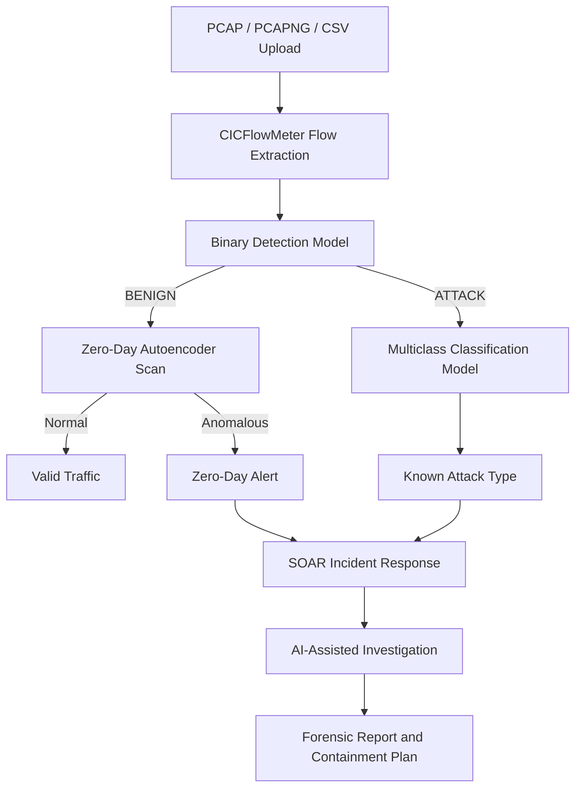

# 🛡️ Hybrid IDS with Zero-Day Detection and SOAR Incident Response

A full-stack network intrusion detection and incident response system built for academic and research purposes.
The project combines flow-based machine learning detection, zero-day anomaly detection, and an AI-assisted SOAR incident response dashboard.

## 📌 Overview

This system analyzes network traffic using CICFlowMeter features extracted from PCAP/PCAPNG files or uploaded CSV files. It performs:

* **Binary Detection:** Classifies traffic as `BENIGN` or `ATTACK`.
* **Multiclass Attack Classification:** Identifies the attack category when malicious traffic is detected.
* **Zero-Day Detection:** Uses an Autoencoder to detect anomalous traffic patterns that may not belong to known attack classes.
* **SOAR Incident Response:** Sends detected incidents to an AI-assisted incident response dashboard that generates investigation notes, MITRE ATT&CK mapping, forensic summaries, and containment recommendations.

---

## ✨ Key Features

* **PCAP / PCAPNG / CSV Support**

  * Upload raw packet captures or pre-generated CICFlowMeter CSV files.

* **Flow-Based Intrusion Detection**

  * Uses CICFlowMeter network flow features for machine learning inference.

* **Binary Classification**

  * Detects whether traffic is benign or malicious.

* **Multiclass Attack Classification**

  * Classifies malicious traffic into multiple attack categories such as:

    * DDoS
    * DoS
    * PortScan
    * Botnet
    * Brute Force
    * Web Attacks
    * Infiltration

* **Zero-Day Anomaly Detection**

  * Uses an Autoencoder reconstruction error to detect suspicious unknown traffic patterns.

* **SOAR Incident Response Dashboard**

  * Provides an investigation interface for detected incidents.
  * Generates AI-assisted forensic reports and containment recommendations.

* **MITRE ATT&CK Mapping**

  * Maps detected incidents to relevant attacker tactics and techniques when possible.

---

## 🏗️ System Architecture



---

## 📁 Project Structure

```text
IDS--GP/
├── hybrid_ids_share_with_keys/
│   ├── app/
│   │   ├── main.py
│   │   ├── inference.py
│   │   ├── cicflowmeter_runner.py
│   │   ├── zero_day_detector.py
│   │   ├── ir_agent.py
│   │   └── schemas.py
│   │
│   ├── ui/
│   │   └── streamlit_app.py
│   │
│   ├── models/
│   │   ├── cicids_lstm_out_v2/
│   │   ├── cicids_xgb_flow_v1/
│   │   ├── multiclass_stage2/
│   │   └── zero_day_autoencoder/
│   │
│   ├── incident-response-&-intrusion-detection-agent/
│   │   ├── src/
│   │   ├── server.py
│   │   ├── package.json
│   │   ├── requirements.txt
│   │   └── .env.example
│   │
│   ├── requirements.txt
│   ├── run_all.ps1
│   └── stop_all.ps1
│
├── cicflowmeter_custom/
├── RUN_COMMANDS.txt
└── README.md
```

---

## 📥 1. Download Pre-Trained Models

The trained machine learning models are not included in this repository because of file size limitations.

**Download the models from Google Drive:**

>https://drive.google.com/drive/folders/10nZcbbzJ-ERsfkeD01QSHewGY-HQmxpD?usp=sharing

After downloading:

1. Download `models.zip`.
2. Extract it.
3. Place the extracted `models/` folder inside:

```text
IDS--GP/hybrid_ids_share_with_keys/
```

Your final folder structure should look like this:

```text
hybrid_ids_share_with_keys/
├── models/
│   ├── cicids_lstm_out_v2/
│   ├── cicids_xgb_flow_v1/
│   ├── multiclass_stage2/
│   └── zero_day_autoencoder/
```

---

## ⚙️ 2. Prerequisites

Install the following before running the project:

| Dependency | Recommended Version | Purpose                                    |
| ---------- | ------------------- | ------------------------------------------ |
| Python     | 3.12                | Required for the IDS backend and ML models |
| Node.js    | 18 or newer         | Required for the React SOAR frontend       |
| Java JDK   | 11 or newer         | Required for CICFlowMeter PCAP processing  |

> **Important:** TensorFlow may not work correctly with Python 3.13+. Python 3.12 is recommended.

If you only upload already processed CICFlowMeter CSV files, Java is not required.

---

## 🚀 3. Installation

### Step 1: Clone the Repository

```bash
git clone https://github.com/ghazaly118/IDS--GP.git
cd IDS--GP/hybrid_ids_share_with_keys
```

---

### Step 2: Create the Python Virtual Environment

#### Windows PowerShell

```powershell
Set-ExecutionPolicy -Scope Process -ExecutionPolicy RemoteSigned
py -3.12 -m venv .venv
.\.venv\Scripts\Activate.ps1
pip install -r requirements.txt
```

#### macOS / Linux

```bash
python3.12 -m venv .venv
source .venv/bin/activate
pip install -r requirements.txt
```

---

### Step 3: Configure the SOAR Environment

Go to the SOAR project folder:

```bash
cd incident-response-&-intrusion-detection-agent
```

Create a `.env` file from the example file:

#### Windows PowerShell

```powershell
copy .env.example .env
```

#### macOS / Linux

```bash
cp .env.example .env
```

Open `.env` and add your Gemini API key:

```env
GEMINI_API_KEY=your_api_key_here
APP_URL=http://localhost:5173
```

Install the frontend dependencies:

```bash
npm install
```

Return to the main project folder:

```bash
cd ..
```

---

## 🏃 4. Running the System

You can run the system using the Windows scripts or manually through separate terminals.

---

### Option A: Run Automatically on Windows

From the `hybrid_ids_share_with_keys` folder, run:

```powershell
.\run_all.ps1
```

To stop all services:

```powershell
.\stop_all.ps1
```

---

### Option B: Run Manually

Open three separate terminals from the `hybrid_ids_share_with_keys` folder.

---

### Terminal 1: Run the IDS Backend

#### Windows PowerShell

```powershell
$env:CICFLOWMETER_BIN="C:\path\to\cicflowmeter_custom\bin\CICFlowMeter.bat"
.\.venv\Scripts\python.exe -m uvicorn app.main:app --reload --port 8000
```

#### macOS / Linux

```bash
export CICFLOWMETER_BIN="/path/to/cicflowmeter_custom/bin/CICFlowMeter"
.venv/bin/python -m uvicorn app.main:app --reload --port 8000
```

---

### Terminal 2: Run the Streamlit IDS Dashboard

#### Windows PowerShell

```powershell
.\.venv\Scripts\python.exe -m streamlit run ui/streamlit_app.py
```

#### macOS / Linux

```bash
.venv/bin/python -m streamlit run ui/streamlit_app.py
```

---

### Terminal 3: Run the SOAR Dashboard

```bash
cd incident-response-&-intrusion-detection-agent
npm run dev
```

---

## 🌐 5. Access the Dashboards

After starting the services, open the following URLs:

| Service                          | URL                        |
| -------------------------------- | -------------------------- |
| IDS Dashboard                    | http://localhost:8501      |
| SOAR Incident Response Dashboard | http://localhost:5173      |
| IDS Backend API Docs             | http://127.0.0.1:8000/docs |
| SOAR Backend API Docs            | http://127.0.0.1:8001/docs |

---

## 🎯 6. Demo Workflow

1. Open the IDS Dashboard:

```text
http://localhost:8501
```

2. Upload a PCAP, PCAPNG, or CICFlowMeter CSV file.

3. Click **Analyze**.

4. Review the detection results:

   * Binary prediction
   * Multiclass prediction
   * Zero-day anomaly score
   * Confidence values
   * Generated flow statistics

5. If malicious or anomalous traffic is detected, send the incident to the SOAR dashboard.

6. Open the SOAR Dashboard:

```text
http://localhost:5173
```

7. Select the incident from the queue.

8. Run the AI-assisted incident responder.

9. Review:

   * Investigation notes
   * MITRE ATT&CK mapping
   * Forensic markdown summary
   * Recommended containment actions

---

## 🔐 Environment Variables

The SOAR system uses a `.env` file for configuration.

Example:

```env
GEMINI_API_KEY=your_api_key_here
APP_URL=http://localhost:5173
```

> Never commit real API keys to GitHub. Only commit `.env.example`.

---

## 🛠️ Troubleshooting

### TensorFlow Installation Error

If you see an error like:

```text
No matching distribution found for tensorflow
```

You may be using Python 3.13 or newer. Recreate the virtual environment using Python 3.12:

```powershell
py -3.12 -m venv .venv
```

---

### PowerShell Script Error

If you see:

```text
running scripts is disabled on this system
```

Run:

```powershell
Set-ExecutionPolicy -Scope Process -ExecutionPolicy RemoteSigned
```

Then run the script again.

---

### Port Already in Use

If port `8000`, `8001`, `5173`, or `8501` is already being used, find and kill the process.

Example for port `8000` on Windows:

```powershell
netstat -ano | findstr :8000
taskkill /PID <PID> /F
```

---

### Empty SOAR Report

Check the following:

1. The `.env` file exists inside:

```text
incident-response-&-intrusion-detection-agent/
```

2. The `.env` file contains a valid Gemini API key.

3. The SOAR backend is running.

4. The incident was successfully sent from the IDS dashboard.

---

### CICFlowMeter Not Working

Check that Java is installed:

```bash
java -version
```

Check that the `CICFLOWMETER_BIN` path points to the correct CICFlowMeter executable.

Example on Windows:

```powershell
$env:CICFLOWMETER_BIN="C:\Users\YourName\Desktop\IDS--GP\cicflowmeter_custom\bin\CICFlowMeter.bat"
```

---


## 📚 Dataset

This project is based on network flow features compatible with CICIDS2017-style CICFlowMeter output.

The models expect the same feature structure used during training. For best results, use CICFlowMeter-generated CSV files or PCAP files processed through the included CICFlowMeter workflow.

---

## 🎓 Purpose

This project was developed as a graduation project for academic and research purposes.
It demonstrates how machine learning, anomaly detection, and incident response automation can be combined into a single cybersecurity workflow.

---

## 👨‍💻 Authors

* Ghazaly118

---

## 📄 License

This repository is intended for academic and research use.
