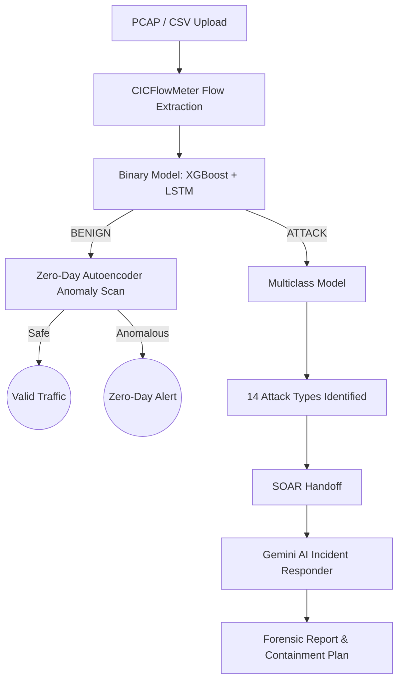

# 🛡️ Hybrid IDS + Zero-Day Detection + SOAR Incident Response

A state-of-the-art, full-stack network intrusion detection and response system. This project combines multiple machine learning models for deep packet inspection with an autonomous AI-driven Incident Response (IR) agent.

## 🌟 Key Features
- **Binary Classification (BENIGN vs ATTACK)**: Uses an ensemble of XGBoost + LSTM for high-accuracy initial detection.
- **Multiclass Attack Classification**: Categorizes malicious traffic into 14 distinct attack types (e.g., DDoS, Brute Force, Web Attacks).
- **Zero-Day Detection**: Utilizes an Autoencoder to calculate reconstruction errors, identifying unknown anomalies and zero-day exploits.
- **SOAR Incident Response**: Powered by Google Gemini AI, it autonomously investigates incidents, generates forensic markdown reports, maps to MITRE ATT&CK, and recommends containment plans.

---

## 🏗️ Architecture Flow



---

## 📥 1. Download Pre-trained Models (Required)

Due to file size constraints, the trained machine learning models are not hosted in this repository. 

**👉 [INSERT GOOGLE DRIVE LINK HERE] 👈**

1. Download the `models.zip` file from the Google Drive link above.
2. Extract the contents into the root of this project.
3. Your folder structure should look like this:
   ```text
   hybrid_ids_share_with_keys/
   ├── models/
   │   ├── cicids_lstm_out_v2/
   │   ├── cicids_xgb_flow_v1/
   │   ├── multiclass_stage2/
   │   └── zero_day_autoencoder/
   ```

---

## ⚙️ 2. Prerequisites

Ensure you have the following installed before starting:

| Dependency | Version | Notes | Download |
|------------|---------|-------|----------|
| **Python** | `3.12` | **Crucial:** TensorFlow does not yet support Python 3.13+. | [Python.org](https://www.python.org/downloads/) |
| **Node.js**| `18+` | Required for the React SOAR frontend. | [Node.js](https://nodejs.org/) |
| **Java JDK**| `11+` | Required for CICFlowMeter (PCAP processing). | [Adoptium](https://adoptium.net/) |

> *Note: If you only plan to upload pre-processed CICFlowMeter `.csv` files, Java is not strictly required.*

---

## 🚀 3. Setup & Installation

### Step 1: Clone the Repository
```bash
git clone https://github.com/ghazaly118/IDS--GP.git
cd IDS--GP/hybrid_ids_share_with_keys
```

### Step 2: Set up Python Environment
Create a virtual environment specifically using Python 3.12:

**Windows PowerShell:**
```powershell
Set-ExecutionPolicy -Scope Process -ExecutionPolicy RemoteSigned
py -3.12 -m venv .venv
.\.venv\Scripts\Activate.ps1
pip install -r requirements.txt
```

**macOS / Linux:**
```bash
python3.12 -m venv .venv
source .venv/bin/activate
pip install -r requirements.txt
```

### Step 3: Configure the SOAR Environment
The SOAR agent requires a Google Gemini API key to generate automated forensic reports. 
Get a free key here: [Google AI Studio](https://aistudio.google.com/apikey)

```bash
cd incident-response-&-intrusion-detection-agent
cp .env.example .env
```
Open `.env` and add your key:
```env
GEMINI_API_KEY=your_actual_api_key_here
APP_URL=http://localhost:5173
```

Install the Node dependencies:
```bash
npm install
cd ..
```

---

## 🏃 4. Running the System

You have two options to run the system: using the automated scripts (Windows) or manually.

### Option A: One-Click Launch (Windows Only)
Run the included PowerShell scripts from the project root:
```powershell
# To Start all services:
.\run_all.ps1

# To Stop all services:
.\stop_all.ps1
```

### Option B: Manual Launch (All OS)
Open **3 separate terminals** from the project root:

**Terminal 1: Hybrid IDS Backend**
```powershell
# Windows
$env:CICFLOWMETER_BIN="C:\path\to\cicflowmeter_custom\bin\CICFlowMeter.bat"
.\.venv\Scripts\python.exe -m uvicorn app.main:app --reload --port 8000

# macOS/Linux
export CICFLOWMETER_BIN="/path/to/cicflowmeter_custom/bin/CICFlowMeter"
.venv/bin/python -m uvicorn app.main:app --reload --port 8000
```

**Terminal 2: Streamlit IDS Dashboard**
```bash
# Windows
.\.venv\Scripts\python.exe -m streamlit run ui/streamlit_app.py

# macOS/Linux
.venv/bin/python -m streamlit run ui/streamlit_app.py
```

**Terminal 3: SOAR Backend + React UI**
```bash
cd incident-response-&-intrusion-detection-agent
npm run dev
```

---

## 🌐 5. Accessing the Dashboards

Once everything is running, access the interfaces here:

| Service | Local URL |
|---------|-----------|
| 🛡️ **IDS Dashboard (Streamlit)** | [http://localhost:8501](http://localhost:8501) |
| 🚨 **SOAR Incident Response (React)** | [http://localhost:5173](http://localhost:5173) |
| 🔌 IDS Backend API (Swagger) | [http://127.0.0.1:8000/docs](http://127.0.0.1:8000/docs) |
| 🔌 SOAR Backend API (Swagger) | [http://127.0.0.1:8001/docs](http://127.0.0.1:8001/docs) |

---

## 🎯 6. Demo Workflow

1. Open the **IDS Dashboard** (`localhost:8501`).
2. Upload a **PCAP, PCAPNG, or CICFlowMeter CSV** file.
3. Click **Analyze**.
4. Review the AI inferences (Binary → Multiclass / Zero-Day).
5. If malicious traffic is detected, click **"Send to SOAR Incident Response"**.
6. Switch to the **SOAR Dashboard** (`localhost:5173`).
7. Select the new incident from the queue.
8. Click **"Run Autonomous AI Incident Responder"**.
9. Review the generated MITRE ATT&CK mappings, forensic report, and containment workflow.

---

## 🛠️ Troubleshooting

- **`tensorflow not found` / No matching distribution:** You are likely using Python 3.13 or newer. TensorFlow requires Python 3.12 or older. Recreate your `.venv` using `py -3.12`.
- **`running scripts is disabled on this system` (Windows):** Run `Set-ExecutionPolicy -Scope Process -ExecutionPolicy RemoteSigned` in your PowerShell.
- **Port already in use:** If a port (like 8000) is locked, you can kill it in Windows using `netstat -ano | findstr :8000` followed by `taskkill /PID <PID> /F`, or simply use the provided `stop_all.ps1` script.
- **Empty SOAR Report:** Ensure your `.env` file exists in the SOAR directory, contains a valid `GEMINI_API_KEY`, and that the SOAR backend is running.

---
*Developed for academic/research purposes.*
